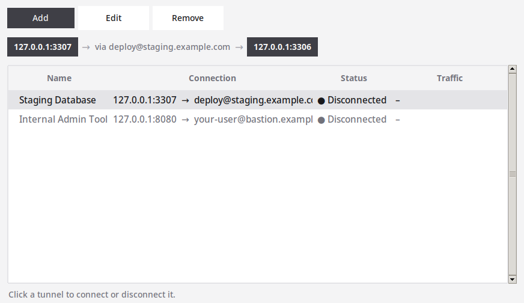
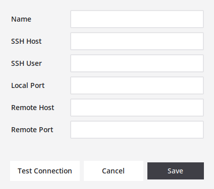

# SSH Tunnel

A GUI + CLI toggle for local SSH port-forwards (e.g. to reach a remote database
through a bastion host) — manage any number of tunnels from one friendly list,
each started/stopped independently, configured in a single JSON file.



## What it does

For each defined tunnel, runs `ssh -N -L <local_port>:<remote_host>:<remote_port>
<ssh_user>@<ssh_host>` in the background and tracks it via its own PID/log file,
so local tools (phpMyAdmin, MySQL Workbench, a DB client, a browser, ...) can
reach the remote service through `127.0.0.1:<local_port>`. Multiple tunnels can
be connected at the same time, each on its own local port.

## Requirements

Built for Linux (system tray + traffic readout both rely on Linux-specific
APIs — see below); the rest is plain Python and should run anywhere.

- Python 3 with Tkinter (`python3-tk` on Debian/Ubuntu) for the GUI
- An `ssh` client on `PATH`
- Key-based SSH auth already set up for each target host (no password prompts —
  tunnels are started as background processes without a terminal)
- Optional, for the system tray icon: GTK3 Python bindings (`python3-gi` on
  Debian/Ubuntu). Without it, closing the window quits the app normally instead
  of minimizing to the tray.
- The **Traffic** column reads `/proc/<pid>/io`; on non-Linux systems it just
  shows "–".

## Installation

```bash
git clone https://github.com/joruf/ssh-tunnel.git
cd ssh-tunnel
chmod +x run.py
./run.py
```

On first run with no `tunnels.json` yet, the GUI opens with an empty list — use
**Add** to define your first tunnel (see [Configuration](#configuration) below
for the fields). The CLI works the same way once at least one tunnel exists
(see [Usage](#usage)).

## Configuration

All tunnels and the app's display name live in `tunnels.json` in the project
root (see `tunnels.json.example` for the shape):

```json
{
  "app_name": "SSH Tunnel",
  "tunnels": [
    {
      "id": "a1b2c3d4",
      "name": "Staging Database",
      "ssh_host": "staging.example.com",
      "ssh_user": "deploy",
      "local_port": 3307,
      "remote_host": "127.0.0.1",
      "remote_port": 3306
    }
  ]
}
```

| Field         | Meaning                                                    |
|---------------|--------------------------------------------------------------|
| `name`        | Display name shown in the list                                |
| `ssh_host`    | SSH server to tunnel through                                  |
| `ssh_user`    | SSH user                                                       |
| `local_port`  | Local port to forward from (`127.0.0.1:<local_port>`)          |
| `remote_host` | Host to reach *from the SSH server's point of view*            |
| `remote_port` | Port on `remote_host`                                          |

Tunnels themselves are managed via the GUI's **Add**/**Edit**/**Remove** buttons,
which include a **Test Connection** check (SSH reachability + whether
`remote_host:remote_port` is reachable from the server) before you save. The
app's display name (window title / tray tooltip) is just the `app_name` field
in `tunnels.json` — edit that by hand if you want to rename it.

`tunnels.json` is gitignored, since it holds real host/user data — commit
`tunnels.json.example` instead.

### Migrating from the old single-tunnel `.env`

Older versions of this tool configured a single tunnel via a `.env` file. If
`tunnels.json` doesn't exist yet and a `.env` is found, it's automatically
migrated into a first `tunnels.json` entry on first run, and the `.env` is
renamed to `.env.migrated` (not deleted).

## Usage

```bash
./run.py                          # start the GUI
./run.py --tray                   # start hidden, only in the system tray
./run.py list                     # list all defined tunnels with status
./run.py status [name]            # show status of one tunnel, or all
./run.py start|stop|toggle <name> # act on one tunnel by name
```

In the GUI, double-click a tunnel's row to connect or disconnect it; a single
click just selects it and shows its route above the list. While connected, the
**Traffic** column shows a live ↓/↑ throughput rate (read from
`/proc/<pid>/io`, so Linux only). Closing the window minimizes it to the
system tray (if available); the tray icon's context menu has **Show** and
**Exit**.

Only one GUI instance runs at a time — starting `./run.py` again while it's
already open just brings the existing window to the front instead of opening
a duplicate.

### Autostart (tray only)

`./run.py --tray` starts the app straight into the system tray without showing
the window — that's the mode meant for autostart, so a login doesn't pop the
window into your face. Click the tray icon (or run `./run.py` again) to bring
the window up. Without the flag the window always opens normally, so the
manual start stays unchanged.

If a tray icon isn't available (GTK3 bindings missing), `--tray` falls back to
showing the window, since a hidden window would otherwise be unreachable. When
an instance is already running, `--tray` just exits quietly instead of raising
that instance's window.

To autostart it, drop a desktop entry into `~/.config/autostart/`:

```ini
[Desktop Entry]
Type=Application
Name=SSH Tunnel
Exec=/path/to/ssh-tunnel/run.py --tray
X-GNOME-Autostart-enabled=true
X-GNOME-Autostart-Delay=6
```

The small startup delay gives the desktop's tray area time to come up before
the icon is registered.



## How it works

`ssh_tunnel/core.py` holds the shared tunnel start/stop/status logic and
`tunnels.json` loading/saving; `run.py` is the single entry point that either
launches the Tkinter GUI (`ssh_tunnel/gui.py`) or runs one CLI action. Each
tunnel gets its own PID and log file under `~/.cache/ssh-tunnel/<tunnel-id>.*`,
so the GUI and CLI agree on what's running regardless of which one started it.

## Tests

```bash
python3 -m pytest tests/
```

Tests patch `tunnels.json`/PID paths to temporary locations, so they never
touch your real configuration or running tunnels. `test_core.py` and
`test_run_cli.py` are plain logic tests; `test_gui.py` only covers the parts
of the GUI module that don't require a display (it never constructs a Tk
window), so the whole suite runs headless — no Xvfb needed.

## Project layout

```
run.py                    entry point (GUI by default, CLI actions as arguments)
ssh_tunnel/
    core.py                tunnel start/stop/status, tunnels.json loading/saving
    gui.py                 Tkinter GUI (tunnel list, add/edit/remove dialogs)
    tray.py                GTK3 system tray icon
tests/
    test_core.py           unit tests for ssh_tunnel/core.py
    test_gui.py             unit tests for the display-independent parts of ssh_tunnel/gui.py and tray.py
    test_run_cli.py         unit tests for run.py's CLI commands
assets/
    icon.png                window/taskbar icon
    screenshot-*.png        README screenshots
tunnels.json.example       template — copy fields into tunnels.json via the GUI
```
